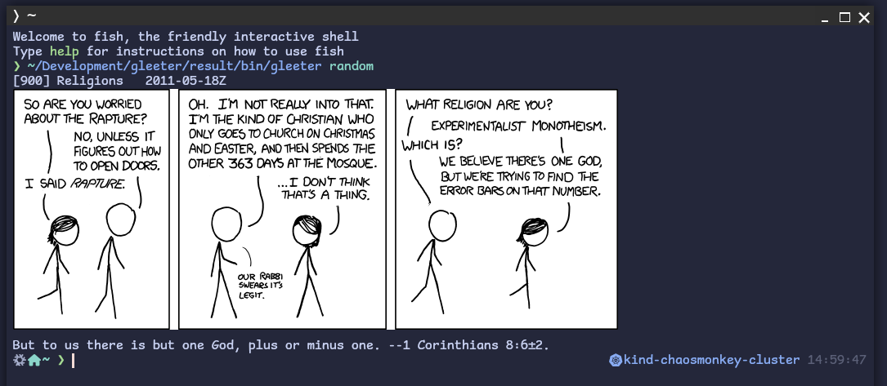
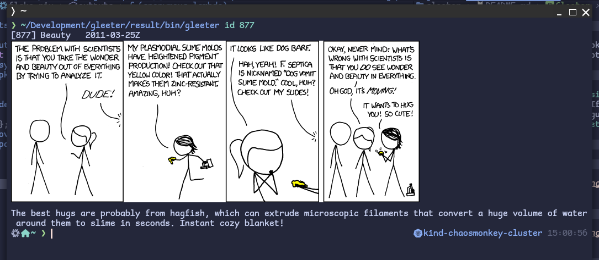

# Gleeter

Very simple and straightforward software to fetch comics from [xkcd](https://xkcd.com) and
display them in the terminal.

For this to work, you need a terminal compatible with the [kitty graphics protocol](https://sw.kovidgoyal.net/kitty/graphics-protocol/),
as far my knowledge goes, today only [kitty](https://sw.kovidgoyal.net/kitty/) and [WezTerm](https://wezfurlong.org/wezterm/index.html) do implement this protocol
(but I may be terribly wrong and I apologize).

## How to use

Gleeter may be used in 3 different ways:

* Without arguments or by providing `latest` as the argument: it will fetch the
latest comic from XKCD and display it into the terminal.
* Providing `random` as the argument: it will fetch a random comic from XKCD
(**warning**: some very old comics, IDs ranging from 1 to 120 and probably
more, won't display in the terminal, I don't know why, probably a very old
PNG compression which is not supported by the graphics protocol).
* Providing `id xx` where `xx` is an integer, will fetch the comic with the
given ID and display it into the terminal.

## How to install

Right now, only NixOS and nixpkgs using flakes installations are supported out
of the box, I will add more options in the future.

### NixOS and nixpkgs

Simply run `nix run github:massix/gleeter -- random` (replace `random` with
whatever argument you want). If you want to install locally, you can add the
overlay in your flakes' configuration and you will then be able to install
the package with the name `gleeter`.

## Screenshots

### Latest comic

  

### Random Comic

  

### Fetch a comic by ID

  

