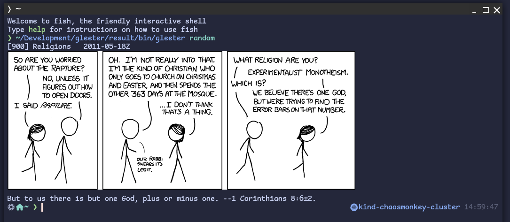
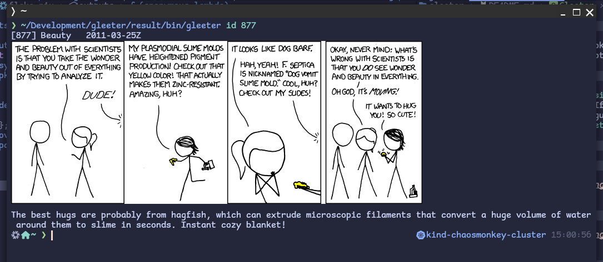
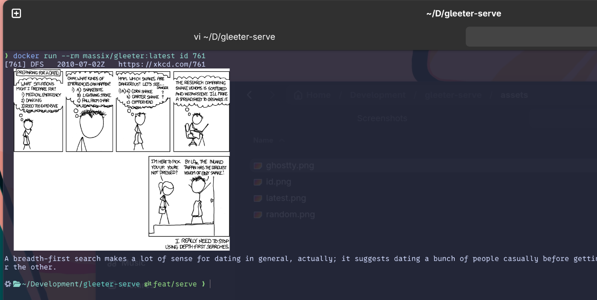
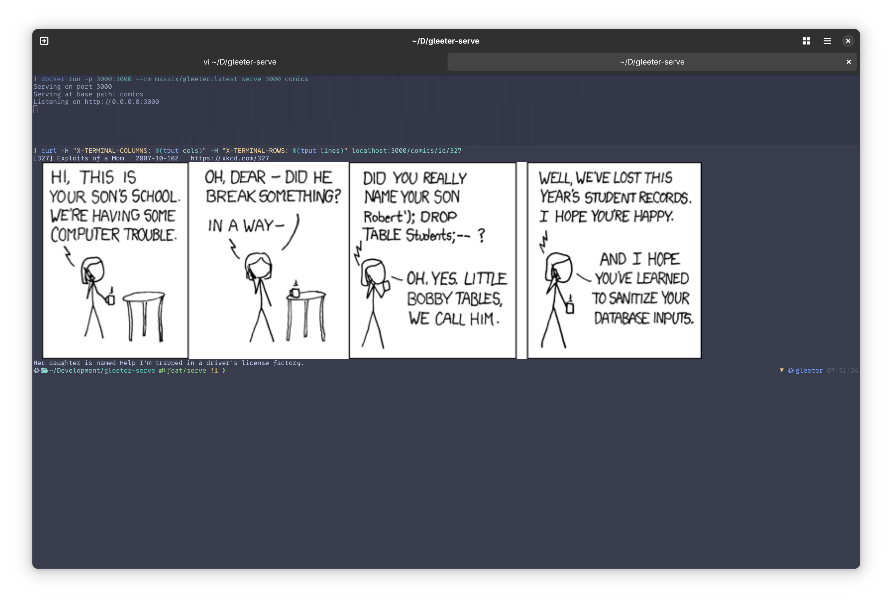

# Gleeter

Very simple and straightforward software to fetch comics from [xkcd](https://xkcd.com) and display them in the terminal.

For this to work, you need a terminal which understands the [Terminal Graphics Protocol](https://sw.kovidgoyal.net/kitty/graphics-protocol/).

Gleeter is known to work well with the following terminals:

*   [Ghostty](https://ghostty.dev/)
*   [Kitty](https://sw.kovidgoyal.net/kitty/)
*   [Wezterm](https://wezfurlong.org/wezterm/)
*   [iTerm2](https://iterm2.com/)
*   ... and probably more

## Test it out now

If you are not interested in knowing the insights of the project or to develop it, you can start using
it without installing anything: simply
`curl -H "X-TERMINAL-ROWS: $(tput lines)" -H "X-TERMINAL-COLUMNS: $(tput cols)" https://xkcd.massi.rocks/comics/latest`

Replace `latest` with `random` or `id/<comic_id>` to change the behavior!

The service is not guaranteed.

## Screenshots

### Latest comic
<div align="center">
  
</div>

### Random Comic
<div align="center">
  
</div>

### Fetch a comic by ID
<div align="center">
  
</div>

### Running on Ghostty via Docker
<div align="center">
  
</div>

### Serve mode using Docker and Ghostty
<div align="center">
  
</div>

## How to use

Gleeter understands the following commands:

*   `help`: Prints help information, this is also the default behavior if no arguments are provided.
*   `version`: Prints the application version.
*   `latest`: Fetches the latest comic from XKCD and displays it in the terminal.
*   `random`: Fetches a random comic from XKCD. **Warning**: Some very old comics (IDs ranging from 1 to 120 and possibly more) might not display correctly due to unsupported PNG compression.
*   `id <number>`: Fetches the comic with the specified ID and displays it in the terminal. Replace `<number>` with the desired comic ID.
*   `serve <port> <base_path>`: Starts a web server to serve the comics. `<port>` is optional and defaults to 8080. `<base_path>` is also optional and defaults to "". For example, `gleeter serve 3000 /comics` will start the server on port 3000 and serve the comics under the `/comics` path.

## Configuration File

Gleeter uses a TOML configuration file to customize its behavior. The configuration file allows you to configure the starting comic for random mode, set screen dimensions, and define aliases for comic IDs.

### Syntax

Here's an example configuration file (based on `test_data/config.toml`):

```toml
random_start = 38

[screen]
max_cols = 80
max_lines = 23

[[alias]]
name = "bobbytables"
type = "id"
id = 987

[[alias]]
name = "rnd"
type = "random"

[[alias]]
name = "l"
type = "latest"
```

### Structure and Usage

The configuration file is loaded when Gleeter starts. Gleeter looks for the configuration file in `$XDG_CONFIG_HOME/gleeter/config.toml` or `$HOME/.config/gleeter/config.toml`. If neither of these is found, it uses `./config.toml`.  The settings defined in the file are used to initialize the application and control its behavior.

*   **`random_start`**: Specifies the starting comic number for the random comic selection. If not specified, a default value is used.

*   **`[screen]`**: This section configures the screen dimensions for displaying comics.
    *   `max_cols`: Specifies the maximum number of columns to use for displaying the comic.
    *   `max_lines`: Specifies the maximum number of lines to use for displaying the comic.

*   `[[alias]]`**: This section defines aliases for accessing comics. You can define multiple aliases.
    *   `name`: The name of the alias. Alias names **must not** be empty and **must not** contain any of the following characters: `!`, `;`, `$`, `:`, `\`, `"`, `'`, `(`, `)`, space, tab, newline, or carriage return. Leading and trailing whitespaces will be automatically removed.
    *   `type`: The type of alias. Valid values are `"id"`, `"random"`, and `"latest"`.
    *   `id`: (Only required for `"id"` aliases) The comic ID to associate with the alias.

The [config.gleam](src/gleeter/config.gleam) file defines the structure of the configuration data and how it is parsed from the TOML file.

To modify Gleeter's behavior, simply edit the configuration file and restart the application.

### Serve mode details

When Gleeter is run in `serve` mode, it starts an HTTP server that exposes the following endpoints:

*   `/`: Serves the latest comic.
*   `/latest`: Serves the latest comic (same as `/`).
*   `/random`: Serves a random comic.
*   `/id/<number>`: Serves the comic with the specified ID. Replace `<number>` with the desired comic ID.

You can customize the base path for these endpoints by using the `<base_path>` argument. For example, if you start the server with `gleeter serve 8080 /comics`, the endpoints will be:

*   `/comics/`
*   `/comics/latest`
*   `/comics/random`
*   `/comics/id/<number>`

Gleeter also supports receiving the terminal size via HTTP headers. You can send the `X-TERMINAL-COLUMNS` and `X-TERMINAL-ROWS` headers with your request to specify the terminal size. This allows Gleeter to properly format the comic for your terminal. If these headers are not provided, Gleeter will use a default terminal size. Please be aware that for the resizing to work, you need to send **both** headers.

#### Serve and Configuration file
Serve mode will also honour all the aliases defined in the [configuration file](#configuration-file), and expose them all at the root of the `base_path`. As a quick example, imagine you have the following defined in the `config.toml` file:
```toml
[[alias]]
name = "bobbytables"
type = "id"
id = 987

[[alias]]
name = "rnd"
type = "random"

[[alias]]
name = "l"
type = "latest"
```

And you start the server with `gleeter serve 8080 /comics`, on top of the URLs mentioned above, you will also get the following:
*   `/comics/bobbytables`, which will be an alias for `/comics/id/987`
*   `/comics/rnd`, which will be an alias for `/comics/random`
*   `/comics/l`, which will be an alias for `/comics/latest`

#### Health Check
In addition to serving comics, Gleeter provides a `/health` endpoint. This endpoint returns a JSON structure with information about the server's status and performance. The structure includes the following fields:

*   `cache_status`: A boolean indicating whether the cache is enabled.
*   `cache_elements`: The number of elements currently stored in the cache.
*   `processed_queries`: The number of queries processed by the server since it started.
*   `current_version`: The version of Gleeter being run.
*   `loaded_aliases`: A list of currently loaded alias names.

Example response:

```json
{
  "cache_status": true,
  "cache_elements": 198,
  "processed_queries": 4,
  "current_version": "Gleeter v1.3.1 (https://github.com/massix/gleeter)",
  "loaded_aliases": [
    "wikipedia",
    "programmers",
    "compiling",
    "sudo",
    "standards",
    "techsupport",
    "bobbytables",
    "tenthousand",
    "correlation"
  ]
}
```

This endpoint can be useful for monitoring the health and performance of the server.

#### Prometheus Metrics

Gleeter exposes Prometheus metrics that can be used to monitor the server's performance and health. These metrics are available at the `/<base_path>/metrics` endpoint in the Prometheus format.

The following metrics are exposed:

*   `gleeter:http_request_duration_seconds`: A histogram of the duration of HTTP requests in seconds. Labels include the method used (i.e.: "random", "id" or "latest"). Buckets are: `0.1`, `0.25`, `0.5`, `0.75`, `1.0`, `1.5`.
*   `gleeter:processed_queries_total`: A counter of the total number of processed queries, labeled by comic method (again: "random", "id" or "latest").
*   `gleeter:cache_hits_total`: A counter of the total number of cache hits, labeled by comic method.
*   `gleeter:cache_miss_total`: A counter of the total number of cache misses, labeled by comic method.
*   `gleeter:cached_elements_total`: A counter of the total number of elements currently stored in the cache.
*   `gleeter:memory_used_bytes`: A gauge of the memory used by the Erlang VM in bytes, with labels for different memory slices (e.g., "system", "processes", "ets", "code", "binary", "atom").

These metrics can be used to create dashboards and alerts to monitor the Gleeter server's performance.

A [docker-compose.yaml](./docker-test/docker-compose.yaml) file is provided in the [docker-test](./docker-test/) directory to facilitate local testing with Prometheus and Grafana. To deploy the stack locally, simply run `make docker-test`.  The stack will also automatically configure Grafana to use the Prometheus datasource, which is in turn pre-configured to scrape the metrics from the gleeter service.

Once the stack is running:

1.  Access Grafana in your web browser at `http://localhost:3000`.
2.  Log in with username `gleeter` and password `gleeter`.
3.  Import the [Gleeter-dashboard.json](./docker-test/Gleeter-dashboard.json) dashboard file into Grafana to visualize the Gleeter metrics. You can do this by navigating to "Dashboards" -> "New" -> "Import" and uploading the JSON file.

This setup allows you to easily monitor Gleeter's performance and health locally using Prometheus and Grafana.  The provided dashboard includes panels for displaying processed queries, cache statistics, memory usage, and request duration.

## How to install

Gleeter should be compatible with any operating system that supports [Gleam](https://gleam.run) and [Erlang](https://www.erlang.org/). It has been tested on NixOS and MacOS Darwin. Installation instructions may vary depending on your specific system.

### NixOS and nixpkgs

If you have [Nix flakes](https://nixos.wiki/wiki/flakes) enabled, you can run Gleeter directly with `nix run github:massix/gleeter -- <command>`, replacing `<command>` with `latest`, `random`, `id <number>`, etc.  To install Gleeter locally, you can use the provided overlay in your `pkgs` import. Here is a very basic example on how to use it:

```nix
{
  inputs.nixpkgs.url = "github:nixos/nixpkgs/nixos-unstable";
  inputs.gleeter.url = "github:massix/gleeter";

  outputs = inputs@{ nixpkgs, gleeter, ...}:
  let
    pkgs = import nixpkgs {
      system = "aarch64-darwin";
      overlays = [ gleeter.overlays.default ];
    };
  in
  {
    # From here on, you can use pkgs.gleeter
  };
}
```

### Docker

Gleeter is also available as a Docker image on [Docker Hub](https://hub.docker.com/r/massix86/gleeter). This is a convenient way to run Gleeter without needing to install Gleam or Erlang.

To run Gleeter with Docker, use the following command:

```bash
docker run --rm massix86/gleeter:<version or latest> -- <command>
```

Replace `<version or latest>` with the desired version of Gleeter, or use `latest` to get the most recent version. Replace `<command>` with the Gleeter command you want to run (e.g., `latest`, `random`, `id 42`). The `--rm` flag automatically removes the container when it exits.

For example, to fetch a random comic using the latest version of Gleeter, you would run:

```bash
docker run --rm massix86/gleeter:latest -- random
```

### Other systems

To install on other systems, ensure you have Gleam and Erlang installed. Then, you can build and run the project using Gleam's build tools. Refer to the Gleam documentation for specific instructions.

## Contributions

All contributions are welcome! Feel free to open pull requests or issues to help improve the project.

## License and copyrights

Gleeter is licensed under the MIT License. See [LICENSE.txt](LICENSE.txt) for details.

All xkcd comics displayed by Gleeter are licensed under a Creative Commons license. The intellectual property of xkcd.com belongs to Randall Munroe. Contact details can be found on the xkcd.com website.

I am in no way responsible for the content of the xkcd comics. All attributions and inquiries should be directed to Randall Munroe.

